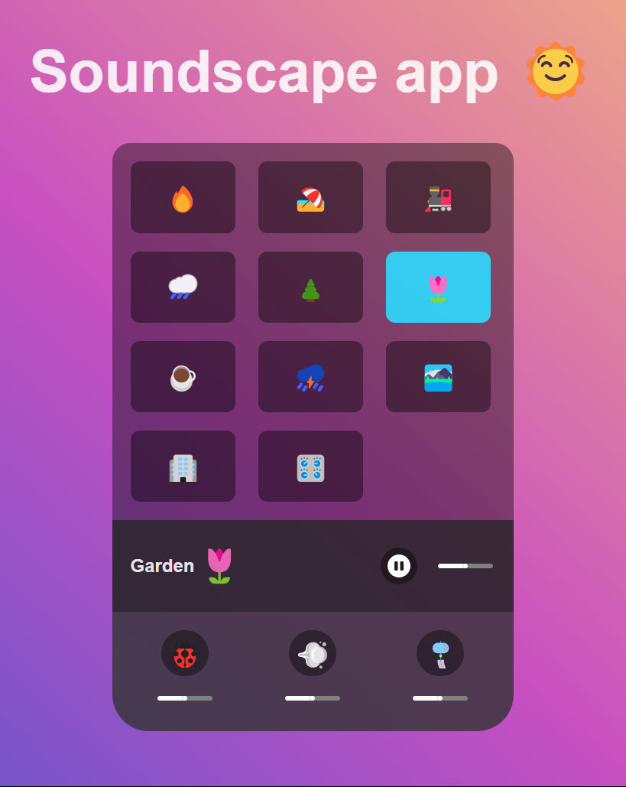

# Soundscape app in ReactJS

The project is to build an app that can play different sound ambiances. Each ambiance has several audio tracks that can be turned on and off and the volume adjusted. 
It is bootstraped with Vite.js.

🔗 **Live preview:** [here](https://enchanting-shortbread-f59db7.netlify.app/)

### Screenshot

## Built with

### Technologies

- HTML
- CSS
- React JS

### Tools

- Vite
- mirageJS for server mockup

## Features

- Use of pinia to store ambiances states
- API calls to get audios and ambiances data
- Choice of different audio ambiances
- Audios tracks selectable

## What I learned

- Better knowledge of **React JS**.
- mirageJS

## Author

👤 **Edouard Desgrée**

- GitHub: [edesgree](https://github.com/edesgree)
